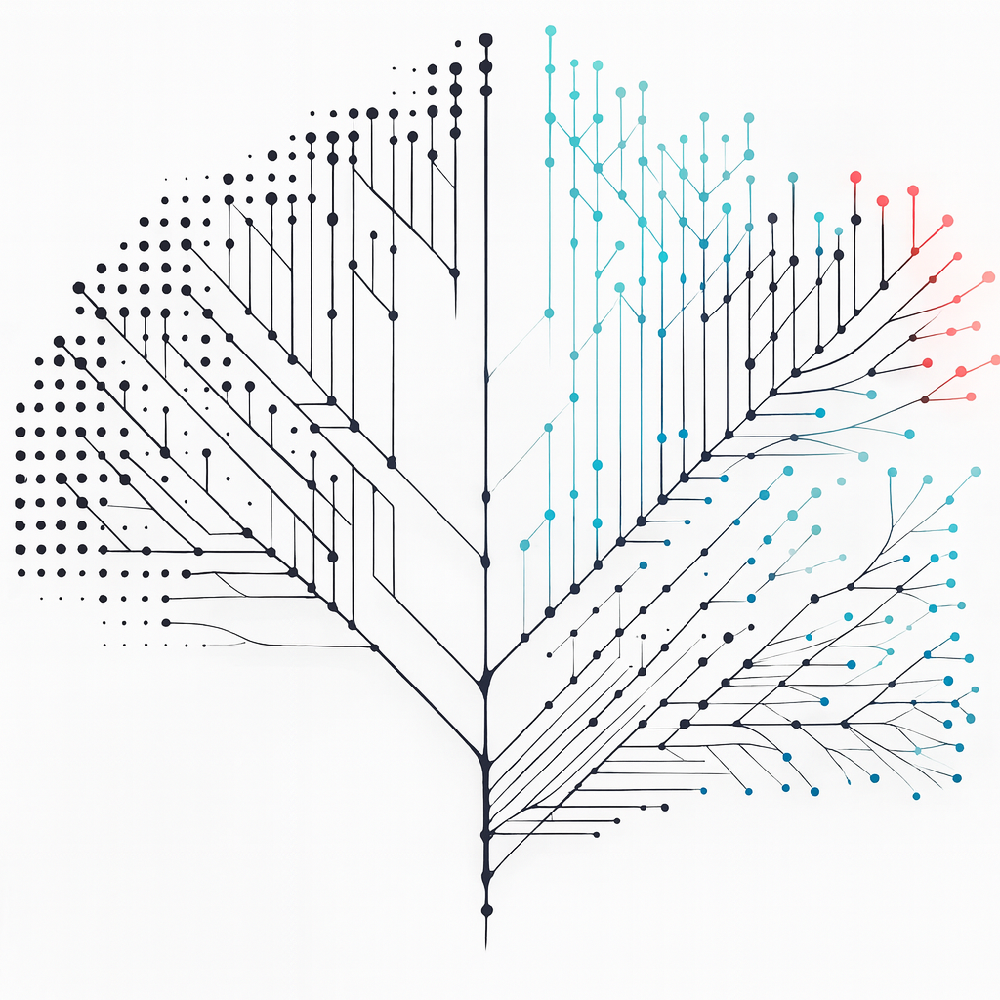

# PhD Thesis *Diversification Models and Neural Inference*

[](https://github.com/EvoLandEco/Thesis/releases/latest)
[](https://github.com/EvoLandEco/Thesis/releases)
[](https://github.com/EvoLandEco/Thesis/releases)
[](https://github.com/EvoLandEco/Thesis/commits/main)
[](LICENSE)

<p align="center">
  <kbd>
    
  </kbd>
</p>

This repository contains the complete LaTeX source, figures, and supporting files for my PhD thesis.

> **Setup note:** This project is intended to be compiled on **Overleaf** (the source works as-is there).

---

## Download the compiled PDF

- **Latest release page:** https://github.com/EvoLandEco/Thesis/releases/latest

---

## Supplementary materials

Additional files that are too large or too numerous for the main thesis repository (e.g., supplementary figures, animations, and supporting materials) are maintained in the companion repository:

- **EvoLandEco/Thesis-Appendix:** https://github.com/EvoLandEco/Thesis-Appendix/

---

## Use on Overleaf

### Option A: Upload a ZIP
1. Click **Code → Download ZIP** on GitHub.
2. In Overleaf, create a new project and **Upload Project** (ZIP).
3. Set the **Main file** to `dissertation.tex`.

### Option B: GitHub–Overleaf sync
If you use Overleaf’s GitHub integration, link this repository to your Overleaf project and keep the repo as the single source of truth.

---

## Repository structure

- `dissertation.tex` — main entry file  
- `acks/` — acknowledgements sources  
- `conclusion/` — conclusion sources  
- `summary/` — summary sources  
- `title/` — title page sources (and cover preview image)  
- `cv/` — CV sources  
- `publications/` — publication sources  
- `introduction/` — introduction sources  
- `chapter*/` — chapter sources  
- `dissertation.cls` — custom class/style  
- `dissertation.bib` — references  

---

## Publications

- **Qin, T.**, Valente, L.†, & Etienne, R.† (2025). *Impact of evolutionary relatedness on species diversification and tree shape.* **Journal of Theoretical Biology**.  
  �� Awarded the inaugural *Denise Kirschner Best Student Paper Prize* (2025).  
  † Joint senior authors.

- **Qin, T.**, van Benthem, K., Valente, L.†, & Etienne, R.† (2025). *Parameter estimation from phylogenetic trees using neural networks and ensemble learning.* **Systematic Biology**.  
  † Joint senior authors.

- **Qin, T.**, van Benthem, K., Valente, L.†, & Etienne, R.†. *Identifying evolutionary relatedness effects on diversification from phylogenies using neural networks.* Manuscript in preparation.  
  † Joint senior authors.

---

## Releases and changelog

I use **GitHub Releases** as the canonical changelog and distribution channel.

- **Changelog (latest):** https://github.com/EvoLandEco/Thesis/releases/latest  
- **All releases:** https://github.com/EvoLandEco/Thesis/releases  

---

## Citation

```bibtex
@phdthesis{qin_diversification_2026,
  title  = {Diversification Models and Neural Inference},
  author = {Qin, Tianjian},
  school = {University of Groningen},
  year   = {2026},
}
```

---

## License

- Code and build/config files: see [LICENSE](LICENSE)
